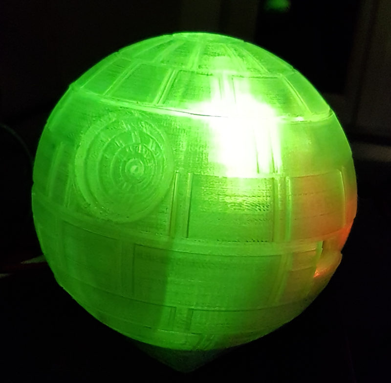

# Imperial-March

Imperial March displayed on Pimoroni's Unicorn Phat

[Unicorn pHAT](https://shop.pimoroni.com/products/unicorn-phat)

put it on your raspberry pi in a 3D printed rpi death star case, 3D printed with tranparent PLA and your rpi lights up on a imperial march tempo!

[Starwars Deathstar raspberry Pi 3 case](https://www.myminifactory.com/object/3d-print-starwars-deathstar-raspberry-pi-3-case-50612)

Launch this script with 'sudo python imperial_march.py' or within a cronjob, and it will light with a different set of colors each time!!

the result is just fun!

Videos here : 

[Blinking deathStar rpi case](https://tube.freepeople.fr/videos/watch/32094757-5844-4293-99eb-1ece17ab81e7)

On this one, the original music to check lights' sync
[Blinking deathStar raspberry pi case on imperial march](https://tube.freepeople.fr/videos/watch/c89a7860-5adf-4538-a86c-5da47a95a984)

PS : did not use randint starting from 0, but from 10, this to prevent some dark colors (quick&dirty, I know)

Credits :

started with (https://github.com/FreakiNiki/Imperial-March)

but got longer imperial march's melody from (https://gist.github.com/tagliati/1804108)

Thank you [FreakiNiki](https://github.com/FreakiNiki) & [tagliati](https://gist.github.com/tagliati)

